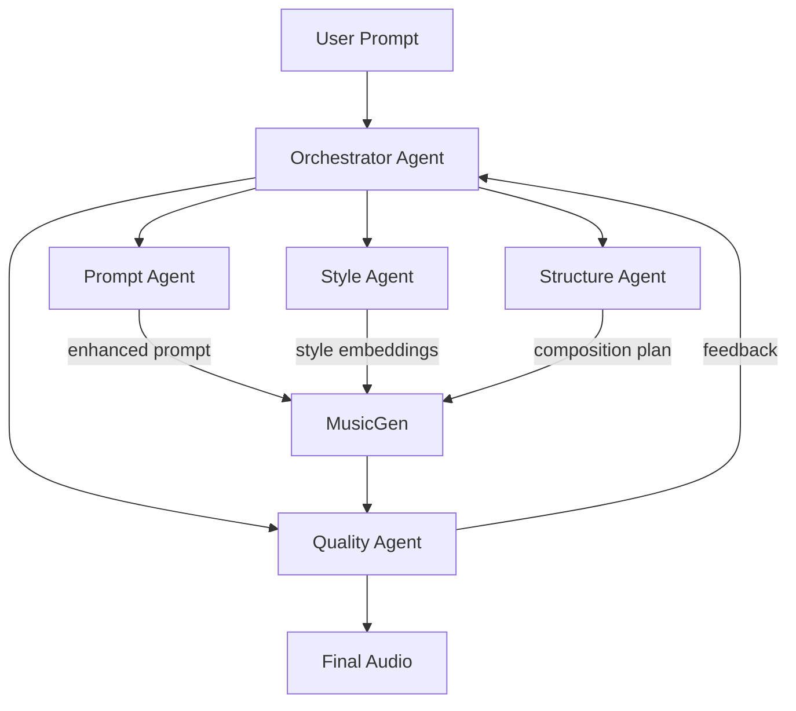
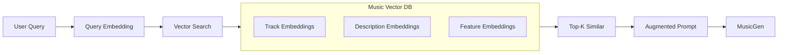
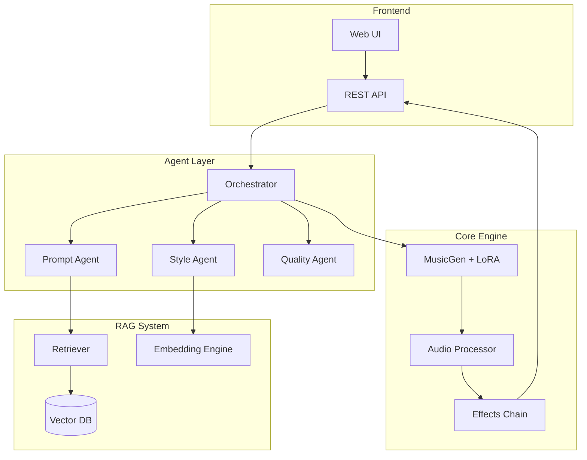

# MusicGen Studio Enhancement Plan

A roadmap for transforming MusicGen Studio into an advanced AI-powered music creation platform.

---

## Phase 1: Multi-Agent Architecture (MAAD - Multi-Agent Audio Design)

### Overview

Deploy lightweight LLMs as specialized agents, each handling distinct aspects of music creation.

### Agent Definitions

| Agent | Model | Purpose |
|-------|-------|---------|
| **Orchestrator** | Phi-3-mini (3.8B) | Routes tasks, coordinates agents, manages workflow |
| **Prompt Agent** | Qwen2-1.5B | Expands/refines user prompts into detailed descriptions |
| **Style Analyzer** | TinyLlama (1.1B) | Analyzes reference tracks, extracts style characteristics |
| **Structure Agent** | Phi-3-mini | Plans song structure (intro, verse, chorus, bridge) |
| **Quality Agent** | Phi-3-mini | Evaluates output, suggests improvements |
| **Metadata Agent** | TinyLlama | Generates rich metadata, tags, descriptions |

### Implementation

#### [NEW] agents/orchestrator.py

- Central coordinator using llama.cpp for local inference
- Message routing between agents
- State management for generation sessions

#### [NEW] agents/prompt_agent.py

- Prompt expansion and refinement
- Musical terminology enhancement
- Context enrichment from user history

#### [NEW] agents/style_agent.py

- Reference track analysis
- Style extraction and encoding
- Genre/mood classification

---

## Phase 2: RAG (Retrieval-Augmented Generation) System

### Overview

Use vector embeddings of your music collection to enable reference-based generation.

### Components

#### Music Vector Database

- **Audio Embeddings**: CLAP or MusicFM embeddings of audio chunks
- **Text Embeddings**: Sentence-transformer embeddings of descriptions
- **Feature Vectors**: Tempo, key, energy, danceability features
- **Storage**: ChromaDB or Qdrant (local, no cloud needed)

#### Retrieval Features

| Feature | Description |
|---------|-------------|
| **"Like This Song"** | Upload reference → find similar in your collection |
| **Style Transfer** | Generate new music in style of retrieved tracks |
| **Mashup Mode** | Blend styles from multiple retrieved references |
| **Smart Prompts** | Auto-suggest prompts based on collection analysis |

### Implementation

#### [NEW] rag/embeddings.py

- CLAP audio embeddings (Microsoft CLAP model)
- Text embeddings for descriptions
- Batch processing for large collections

#### [NEW] rag/vectordb.py

- ChromaDB integration
- Similarity search
- Metadata filtering

#### [NEW] rag/retriever.py

- Query processing
- Multi-modal retrieval (audio + text)
- Context augmentation for MusicGen

---

## Phase 3: Additional Features

### 🎛️ Audio Processing

| Feature | Description | Priority |
|---------|-------------|----------|
| **Stem Separation** | Split tracks into drums/bass/vocals/melody using Demucs | High |
| **Audio Effects** | Add reverb, delay, compression, EQ | Medium |
| **Mastering** | Auto-master output with AI (loudness, dynamics) | Medium |
| **Loop Detection** | Find loopable sections in generated audio | Low |
| **BPM Sync** | Generate to match specific tempo | High |

### 🎨 Generation Enhancements

| Feature | Description | Priority |
|---------|-------------|----------|
| **Continuation Mode** | Extend existing audio seamlessly | High |
| **Inpainting** | Regenerate specific sections of audio | Medium |
| **Variation Generation** | Create variations of generated tracks | High |
| **Conditional Generation** | Control specific instruments/elements | Medium |
| **Multi-Track Generation** | Generate separate stems simultaneously | Low |

### 🧠 AI Improvements

| Feature | Description | Priority |
|---------|-------------|----------|
| **Intelligent Prompting** | LLM suggests prompts based on your style | High |
| **Quality Scoring** | Rate generated outputs automatically | Medium |
| **Iterative Refinement** | Agents improve output through multiple passes | High |
| **Style Clustering** | Group similar songs in collection | Medium |
| **Trend Analysis** | Identify patterns in successful generations | Low |

### 📊 Analytics & Insights

| Feature | Description | Priority |
|---------|-------------|----------|
| **Collection Dashboard** | Visualize your music library (genres, moods, keys) | Medium |
| **Training Metrics** | Rich training visualizations (loss curves, samples) | High |
| **Generation History** | Track all prompts and outputs over time | Medium |
| **A/B Comparison** | Compare outputs from different models/settings | Low |

### 🎯 User Experience

| Feature | Description | Priority |
|---------|-------------|----------|
| **Voice Input** | Describe music with voice → transcribe → generate | Medium |
| **Real-time Waveform** | Live visualization during generation | High |
| **Keyboard Shortcuts** | Power-user workflow acceleration | Low |
| **Preset Library** | Save/load generation settings | Medium |
| **Export Formats** | MP3, FLAC, WAV, stems, project files | High |

---

## Phase 4: Advanced Integrations

### DAW Integration

- **VST Plugin**: Load MusicGen as instrument in any DAW
- **Ableton Link**: Sync tempo with other music software
- **MIDI Output**: Generate MIDI alongside audio

### External Services (Optional)

- **Spotify Analysis**: Import playlist characteristics
- **YouTube**: Reference tracks from URL
- **Cloud Training**: Offload training to RunPod/Lambda

---

## Technical Architecture

---

## Recommended Implementation Order

### Sprint 1 (Core Agents) ~1 week

1. Set up llama.cpp with Phi-3-mini
2. Implement Prompt Agent for prompt expansion
3. Integrate into UI with "Enhance Prompt" button

### Sprint 2 (RAG Foundation) ~1 week  

1. Integrate CLAP for audio embeddings
2. Set up ChromaDB for vector storage
3. Index existing collection
4. Add "Find Similar" feature

### Sprint 3 (Multi-Agent) ~1 week

1. Implement Orchestrator
2. Add Style Agent
3. Add Quality Agent with feedback loop

### Sprint 4 (Polish) ~1 week

1. Stem separation with Demucs
2. Audio effects processing
3. Export improvements

---

## Hardware Requirements Update

| Component | Current | With Agents | Notes |
|-----------|---------|-------------|-------|
| **VRAM** | 10-12GB | 10-12GB | Agents use CPU |
| **RAM** | 16GB | 32GB+ | LLMs loaded in RAM |
| **Storage** | 10GB | 50GB+ | Vector DB + models |
| **CPU** | Any | Modern | Phi-3 runs on CPU |

> [!TIP]
> Your 48GB RAM is perfect for running multiple lightweight LLMs simultaneously via llama.cpp with CPU offloading.

---

## Model Downloads Required

| Model | Size | Purpose |
|-------|------|---------|
| [Phi-3-mini-GGUF](https://huggingface.co/microsoft/Phi-3-mini-4k-instruct-gguf) | ~2GB | Orchestrator, Structure |
| [TinyLlama-GGUF](https://huggingface.co/TheBloke/TinyLlama-1.1B-Chat-v1.0-GGUF) | ~700MB | Metadata, Style |
| [CLAP](https://huggingface.co/laion/clap-htsat-unfused) | ~600MB | Audio embeddings |
| [ChromaDB](https://www.trychroma.com/) | ~50MB | Vector storage |
